# Patchwork iOS UI Storyboard

Generated: May 1, 2026  
Device: iPhone 17 Pro simulator, iOS 26.4  
Backend: production Convex defaults in `Patchwork/Core/AppConfig.swift`

Production endpoints verified from the running app source:

- Cloud: `https://vibrant-caribou-150.convex.cloud`
- Site: `https://vibrant-caribou-150.convex.site`
- RevenueCat public key: `appl_KVrqPtiNVMghtWZGRGrnCnBQyfh`

The screenshots in `screenshots/` were captured from the app running through `@build-ios-apps` on the production backend. The review shortcut account used was `review@apple.com`. The production reviewer account currently exposes a signed-in profile, tasker workspace, empty Seek results for the simulator's Toronto fallback location, empty jobs, and empty conversations. Dataful provider, chat, proposal, job detail, and review screenshots require seeded production records or a production-safe fixture account with those states.

## Capture Set

| # | Screen | State | Screenshot |
|---|---|---|---|
| 1 | Auth | Splash | [01-auth-splash.jpg](screenshots/01-auth-splash.jpg) |
| 2 | Auth | Onboarding, providers | [02-auth-onboarding-provider.jpg](screenshots/02-auth-onboarding-provider.jpg) |
| 3 | Auth | Onboarding, reviews | [03-auth-onboarding-reviews.jpg](screenshots/03-auth-onboarding-reviews.jpg) |
| 4 | Auth | Onboarding, grow business | [04-auth-onboarding-business.jpg](screenshots/04-auth-onboarding-business.jpg) |
| 5 | Auth | Sign-in choice | [05-auth-signin-choice.jpg](screenshots/05-auth-signin-choice.jpg) |
| 6 | Auth | Email entry | [06-auth-email-entry.jpg](screenshots/06-auth-email-entry.jpg), [full resolution](screenshots/06-auth-email-entry-fullres.png) |
| 7 | Auth | Review shortcut ready | [09-auth-review-shortcut-ready.jpg](screenshots/09-auth-review-shortcut-ready.jpg) |
| 8 | Auth | Inline email validation error | [08-auth-email-error.jpg](screenshots/08-auth-email-error.jpg) |
| 9 | Permissions | In-app location gate | [10-permission-location-gate.jpg](screenshots/10-permission-location-gate.jpg) |
| 10 | Permissions | iOS system location prompt | [11-system-location-prompt.jpg](screenshots/11-system-location-prompt.jpg) |
| 11 | Seek | Empty results | [12-seek-empty-state.jpg](screenshots/12-seek-empty-state.jpg) |
| 12 | Seek | Radius sheet | [13-seek-radius-sheet.jpg](screenshots/13-seek-radius-sheet.jpg) |
| 13 | Seek | Category sheet | [14-seek-category-sheet.jpg](screenshots/14-seek-category-sheet.jpg) |
| 14 | Profile | Overview, tasker account | [15-profile-overview.jpg](screenshots/15-profile-overview.jpg) |
| 15 | Profile | Settings menu | [16-profile-settings-menu.jpg](screenshots/16-profile-settings-menu.jpg) |
| 16 | Profile | Favourites empty state | [17-profile-favourites-empty.jpg](screenshots/17-profile-favourites-empty.jpg) |
| 17 | Jobs | In-progress empty state | [18-jobs-in-progress-empty.jpg](screenshots/18-jobs-in-progress-empty.jpg) |
| 18 | Jobs | Completed empty state | [19-jobs-completed-empty.jpg](screenshots/19-jobs-completed-empty.jpg) |
| 19 | Messages | Seeker inbox empty state | [20-messages-seeker-empty.jpg](screenshots/20-messages-seeker-empty.jpg) |
| 20 | Messages | Tasker inbox empty state | [21-messages-tasker-empty.jpg](screenshots/21-messages-tasker-empty.jpg) |
| 21 | Profile | Tasker/support/destructive actions | [22-profile-tasker-support-actions.jpg](screenshots/22-profile-tasker-support-actions.jpg) |

## Primary Flow

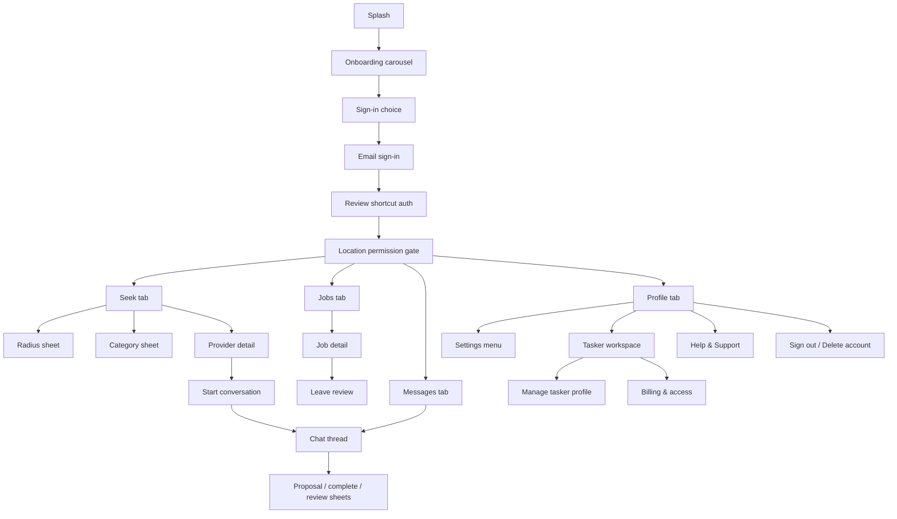

## Visual Storyboard

### Auth And Entry

  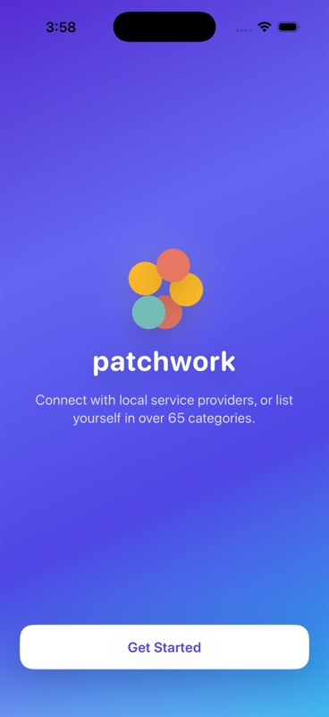
  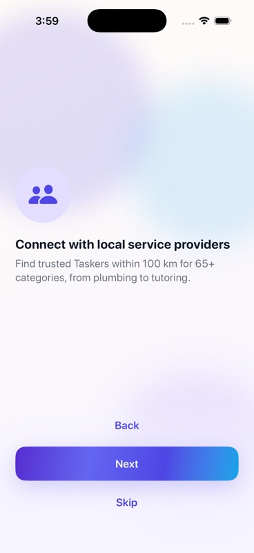
  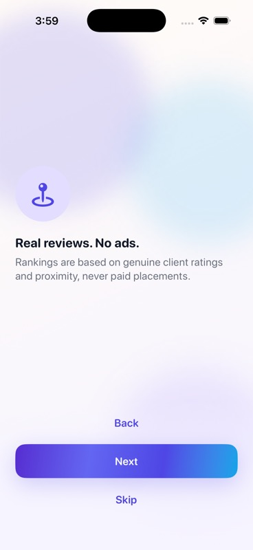
  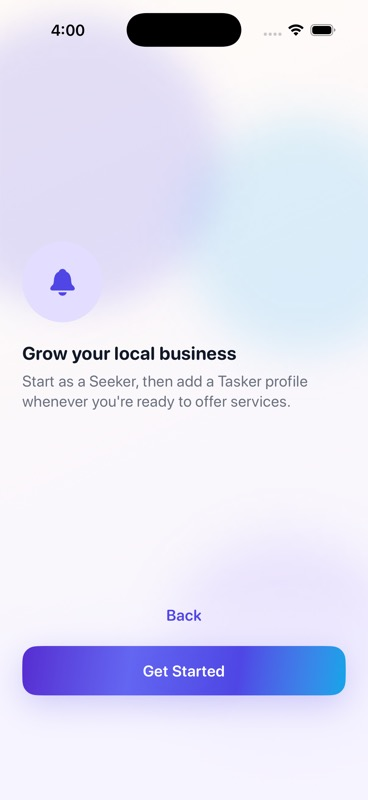

  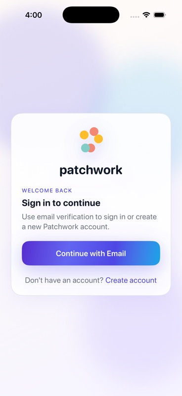
  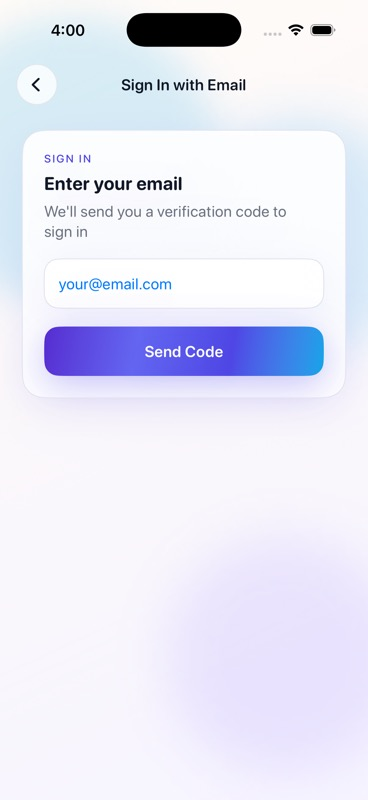
  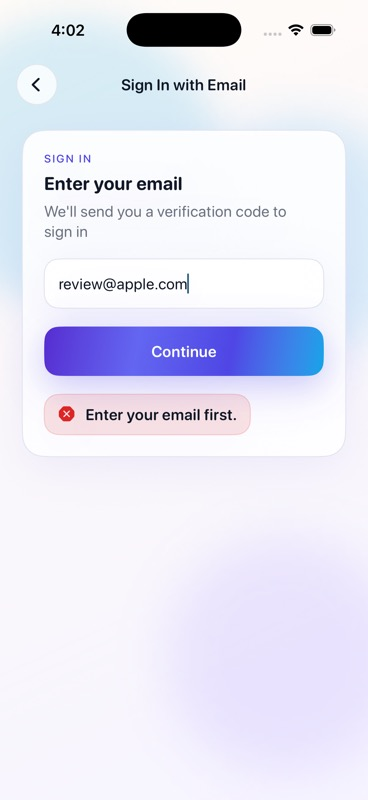
  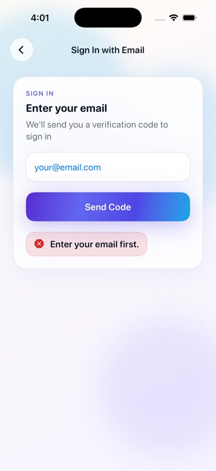

### Permissions And Seek

  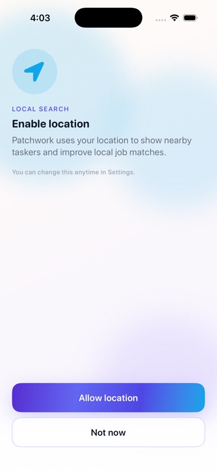
  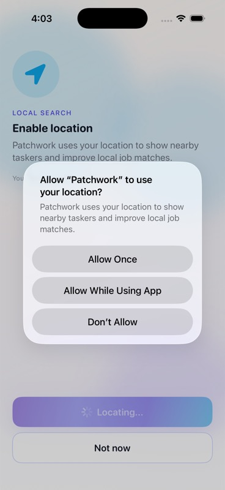
  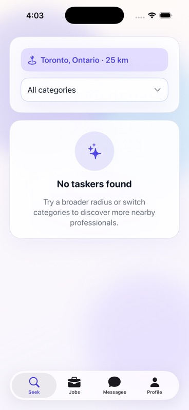
  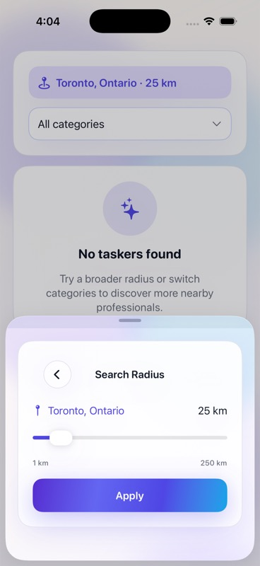
  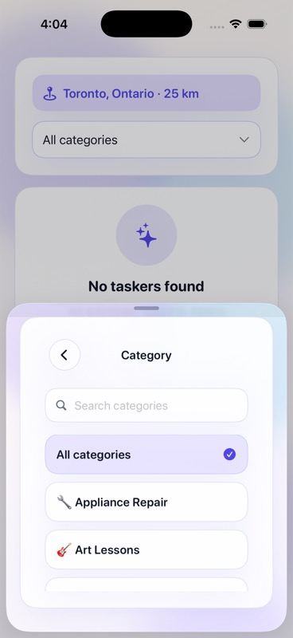

### Tabs And Account

  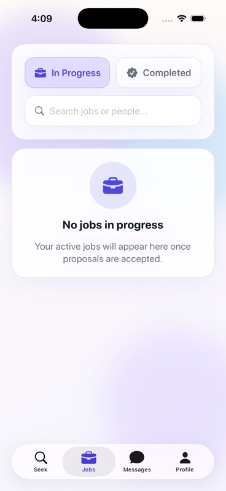
  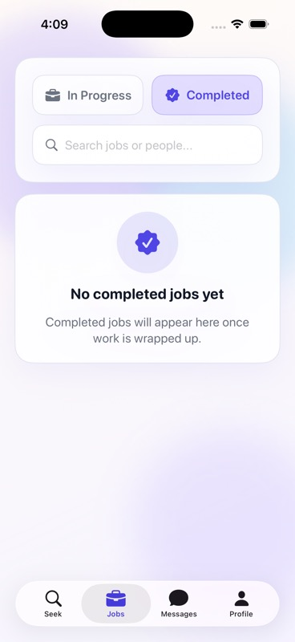
  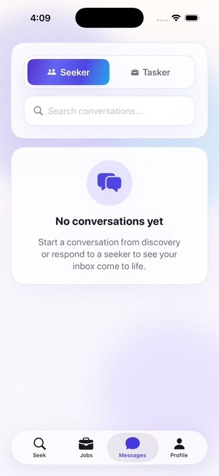
  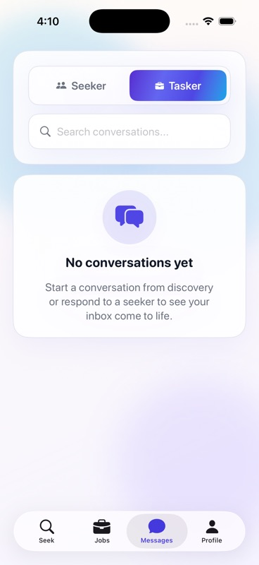

  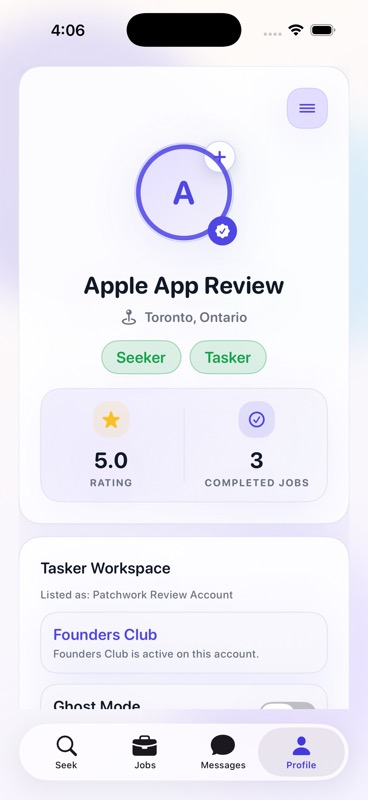
  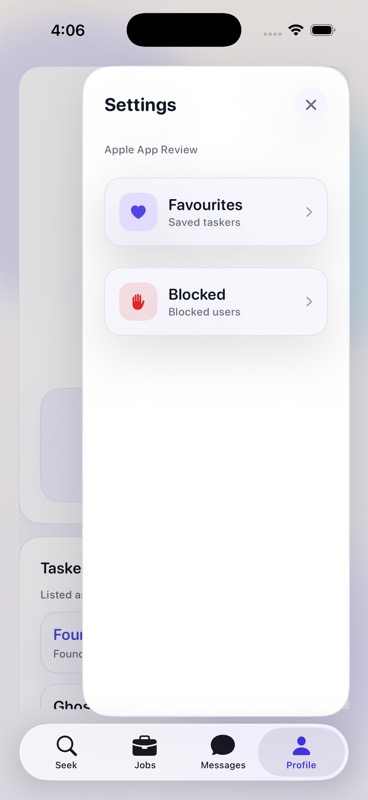
  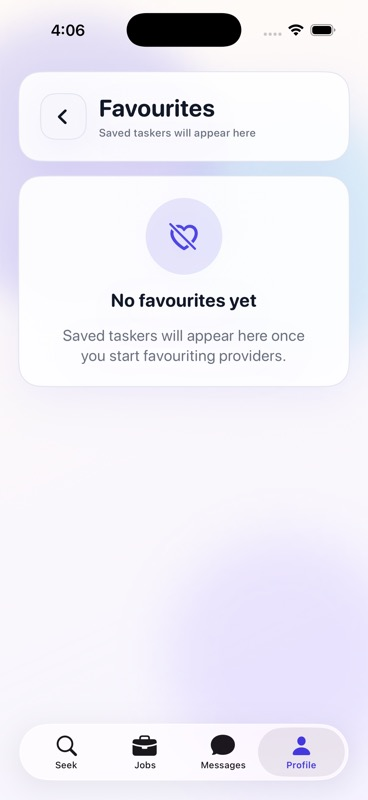
  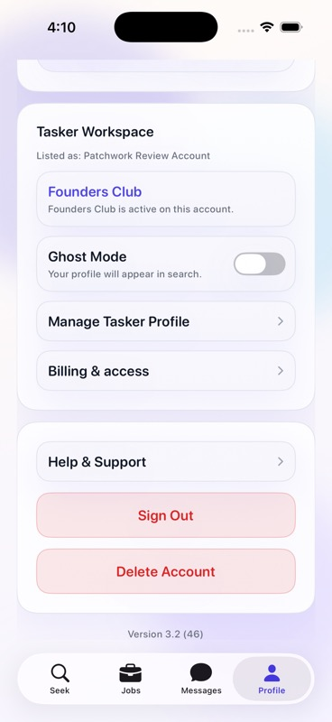

## Screen Inventory

| Area | Screen or State | Production capture status |
|---|---|---|
| Auth | Splash, onboarding, sign-in choice, email entry, inline error | Captured |
| Auth | OTP entry and invalid OTP error | Not reached with `review@apple.com` because the production review shortcut bypasses OTP |
| First run | Profile setup, photo picker, cropper, notification gate | Requires `seeker@apple.com` or a fresh production account; not captured in this pass |
| Permissions | Location gate and iOS location prompt | Captured |
| Seek | Empty result list, radius sheet, category sheet | Captured |
| Seek | Provider cards, provider detail, favourite toggle, start-chat CTA | Requires production taskers near the selected simulator location; not present for the captured account/location |
| Messages | Seeker inbox empty, tasker inbox empty | Captured |
| Messages | Chat thread, composer, proposal cards, proposal sheet, report/block flows | Requires production conversations/proposals seeded for the review account |
| Jobs | In-progress empty, completed empty | Captured |
| Jobs | Job detail, complete confirmation, leave-review flow | Requires production job records seeded for the review account |
| Profile | Overview, settings menu, favourites empty, tasker workspace, support/destructive action section | Captured |
| Profile | Blocked users, help/support detail, delete confirmation alert | Reachable from captured profile but not captured before sign-out; should be added in a second pass |
| Tasker | Founders Club, Ghost Mode, manage profile, billing access entry | Captured as part of profile support/action screenshot |
| Tasker | Manage profile edit screens, category add/edit/remove sheets, subscription/paywall purchase states | Requires second pass or production-safe account reset to avoid mutating the review account |

## Notes

- `@build-ios-apps` successfully built and launched the `Patchwork` scheme from `Patchwork_iOS/Patchwork.xcodeproj` on simulator `6B9BFC94-C485-4055-9B7B-2A74C137FE65`.
- The app source was not changed. This artifact only adds documentation and screenshots.
- The optimized MCP screenshots are `368x800` JPEGs for quick review. `06-auth-email-entry-fullres.png` proves full-resolution simulator capture is available via `xcrun simctl io ... screenshot`; continue future capture passes with that command for all screens where pixel-level inspection is needed.
